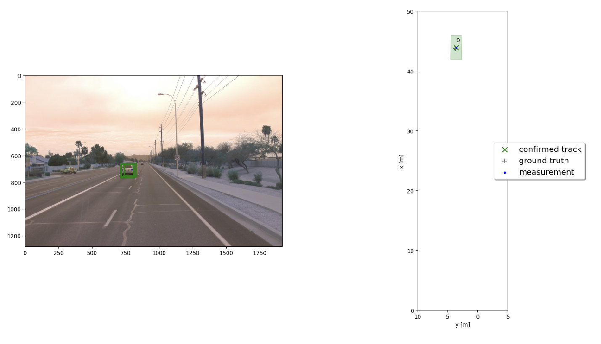
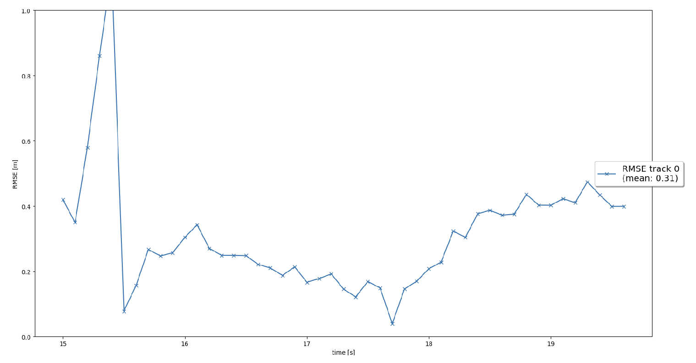
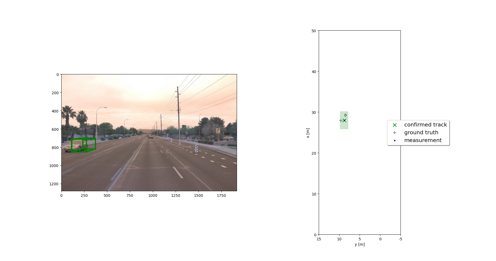
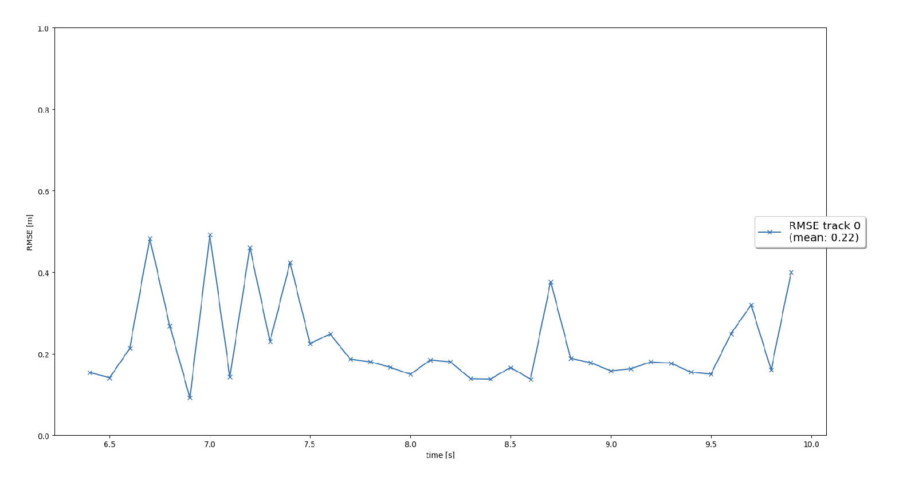
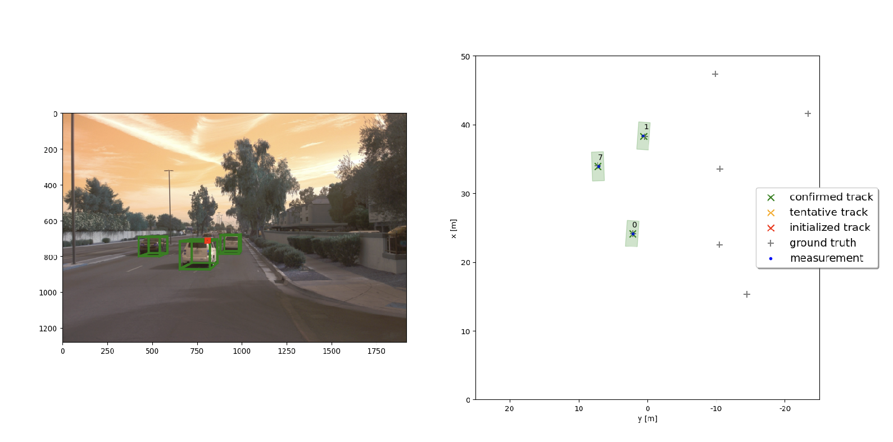
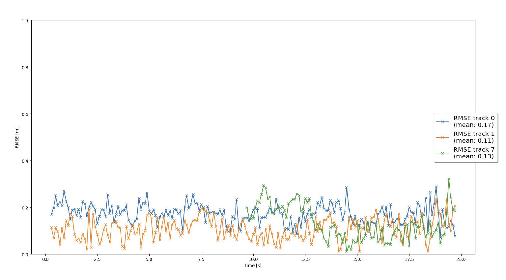
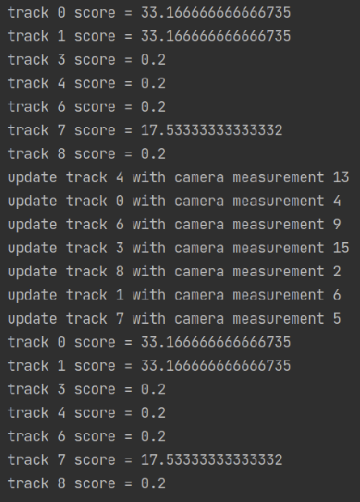
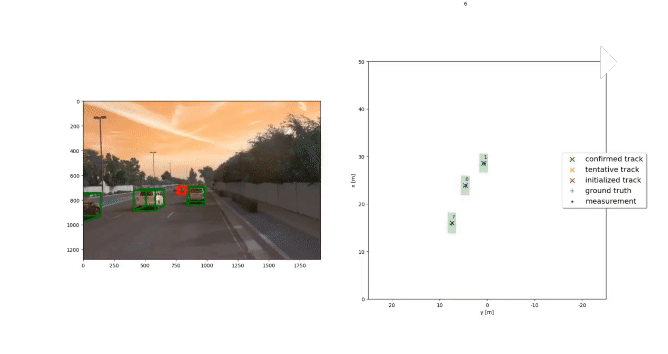
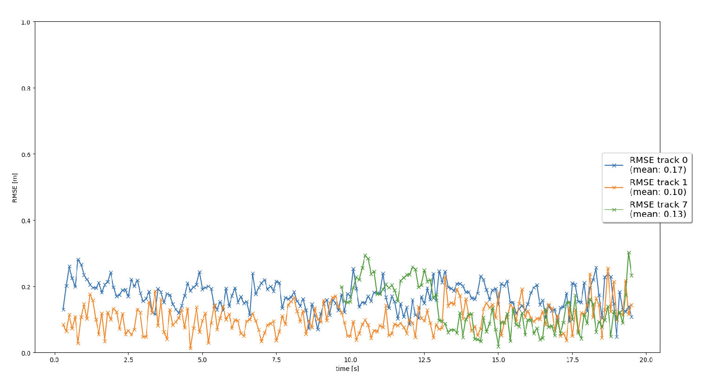

## Project: Sensor Fusion and Object Detection

### Write a short recap of the four tracking steps and what you implemented there (EKF, track management, data association, camera-lidar sensor fusion). Which results did you achieve?

#### Step 1 : EKF Tracking

The first step includes completing the code in the `filter.py` file. A kalman filter is designed with [x,y,z,vx,vy,vz]. The system matrix for the constant velocity process model in 3D and the corresponding process noise covariance depending on the current timestep is calculated. Likewise, the state x and covariance P is updated with associated measurements.

The mean of the RMSE plot at this point is 0.31 which is smaller than the 0.35 as required.

#### Step 2 : Track Management

The second step involves the initialization of new tracks and adjusting the track score for unassigned tracks if it is too high. The tracks have `score` and `state` as attributes. The track state is constantly updated based on its score into `initialized`, `tentative` or `confirmed`. The thresholds for this update are modified based on experiments in the `params.py` file. The tracks are also deleted if the score is very low OR the covariance of px or py bigger than the threshold.

After completing this step, we can see from the below snap that a new track is initialized and confirmed and once the vehicle vanishes from the visible range the tracks are deleted.

#### Step 3 : Data Association

The third step includes completing the code in `associaion.py`. Mahalanobis distance is calculated for all the tracks and measurements pair and subsequently `gating_ok()` function is used to check if a measurement lies inside a track's gate. Then, the corresponding track and measurement for the minimum entry in association_matrix is removed until all track measurement pairs are processed.

After implementing this step, we can see that multiple tracks are updated with multiple measurements. The initialized or tentative “ghost tracks” are deleted if they are not confirmed even after several frames.

<!--

-->

#### Step 4 : Camera-Lidar Fusion

The last step involves completing the code in `measurements.py`. In this part, camera measurements are used to complete the sensor fusion module for camera-lidar fusion. The vehicle coordinates are transformed to sensor coordinates and `in_fov()` is implemented to check if the input state vector x of an object can be seen by the sensor. `get_hx()` is implemented to project camera coordinates to image coordinates and camera measurement objects are initialized in the `Measurement` class.

After implementing this step, we can see that the tracking performs well with no track losses in the gif below. We can also see that the tracks are first initialized(in red) and then moved to tentative(in orange) before getting confirmed(in green).

The first two tracks RMSE track 0(blue line) and RMSE track 1(orange line) are tracked from the beginning to the end(frame 0 - 200) without any track loss. The tracking for the third track RMSE track 7(green line) starts from the 10th second until the end without any track loss too. The mean RMSE for all the tracks are below 0.25 as required.

### Which part of the project was most difficult for you to complete, and why?

Although, the instructions to complete the steps are clear and the structure of the project is organized but at the same time it is complex. There were times when the results for the RMSE charts were not coming as expected and I had to do a lot of debugging only to find a small mistake. Another difficult part was to play around with the parameters in the `params.py` file to get the best results.

### Do you see any benefits in camera-lidar fusion compared to lidar-only tracking (in theory and in your concrete results)?

A disadvantage of lidar sensor is that they don't give a very high-resolution output, likewise a disadvantage of the camera sensor is that it has a limited FOV and gives us no depth information. Combining the outputs from the LiDAR and camera helps in overcoming their individual limitations. The fusion provides confident results for the various applications, be it in-depth finding from an image or object detection applications.

This is evident from the project where after the fusion of the camera and lidar sensor in step-4 the results were much better.

### Which challenges will a sensor fusion system face in real-life scenarios? Did you see any of these challenges in the project?

Fusing data from different sources can come with challenges, such as the difference in data resolution. The lidar output is significantly lower compared to the images being processed by a camera.

This can be visualized in the project when comparing the RMSE. The RMSE value for lidar-only fusion is lower comparatively. Though, this can be mitigated by equaling both the resolutions of LiDAR data and imaging data through an adaptive scaling operation.

### Can you think of ways to improve your tracking results in the future?

- While infrared-based LiDAR systems tend to struggle in conditions such as mist, dust, and fog, the sub-terahertz wavelengths recently developed by MIT, which are between microwave and infrared radiation on the electromagnetic spectrum, can easily be detected in fog and dust clouds, and could be an improvement.

- Implement a more advanced data association, e.g. Global Nearest Neighbor (GNN) or Joint Probabilistic Data Association (JPDA).

- Adapt the Kalman filter to also estimate the object's width, length, and height, instead of simply using the unfiltered lidar detections as we did.
