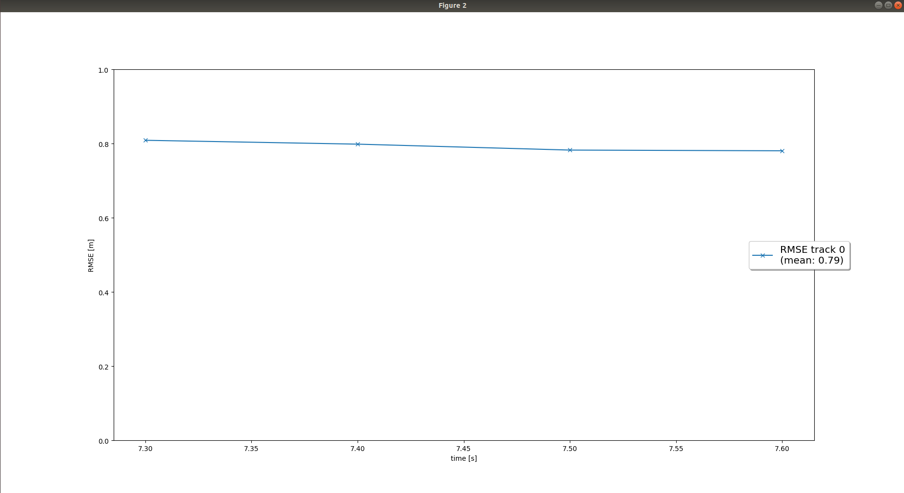

## Project: Sensor Fusion and Object Detection

### Write a short recap of the four tracking steps and what you implemented there (EKF, track management, data association, camera-lidar sensor fusion). Which results did you achieve?

#### Step 1 : EKF Tracking

The first step includes completing the code in `filter.py` file.

#### Step 2 : Track Management

The second step involves the initialization of new tracks and adjusting the track score for unassigned tracks if it is too high. The tracks have `score` and `state` as attributes. The track state is constantly updated based on its score into `initialized`, `tentative` or `confirmed`. The thresholds for this update is modified based on experiments in the `params.py` file. The tracks are also deleted if the score is ver low OR the covariance of px or py bigger than the threshold.

After completting this step, we can see from the below snap that a new track is initialized and confirmed and once the vehicle is vanished from the visible range the tracks are deleted.

#### Step 3 : Data Association

#### Step 4 : Camera-Lidar Fusion

### Which part of the project was most difficult for you to complete, and why?

### Do you see any benefits in camera-lidar fusion compared to lidar-only tracking (in theory and in your concrete results)?

A disadvantage of lidar sensor is that they don't give a very high resolution output, likewise a disadvantage of camera sensor is that it has a limited FOV and gives us no depth information. Combining the outputs from the LiDAR and camera helps in overcoming their individual limitations. The fusion provides confident results for the various applications, be it in depth finding from an image or object detection applications.

This is evident from the project where after the fusion of camera and lidar sensor in step-4 the results were much better.

### Which challenges will a sensor fusion system face in real-life scenarios? Did you see any of these challenges in the project?

Fusing data from different sources can come with chalenges, such as the difference in data resolution. LiDAR output is significantly lower compared to the images being processed by a camera.

This can be visualized in the project when comparing the RMSE. The RMSE value for lidar only fusion is lower comparatively. Though, this can be mitigated by equaling both the resolutions of LiDAR data and imaging data through an adaptive scaling operation.

### Can you think of ways to improve your tracking results in the future?

While infrared-based LiDAR systems tend to struggle in conditions such as mist, dust and fog, the sub-terahertz wavelengths recently developed by MIT, which are between microwave and infrared radiation on the electromagnetic spectrum, can easily be detected in fog and dust clouds, and could be an improvement.

Implement a more advanced data association, e.g. Global Nearest Neighbor (GNN) or Joint Probabilistic Data Association (JPDA).

Adapt the Kalman filter to also estimate the object's width, length, and height, instead of simply using the unfiltered lidar detections as we did.
